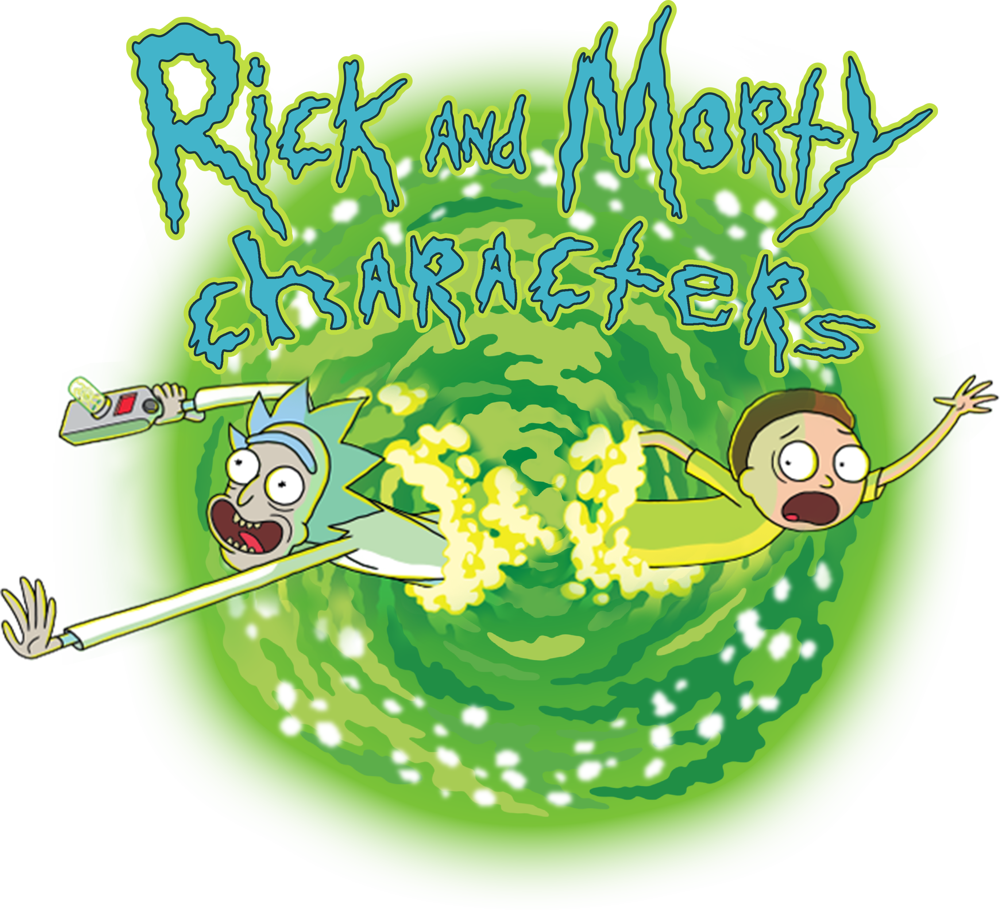

# Rick & Morty - characters
Overview of a random character from
the television show "Rick and Morty"
implemented based on the Rick and Morty API.

Building this project I've learned:
- fetching data from the REST API
- CSS animations
- working with audio in React environment

